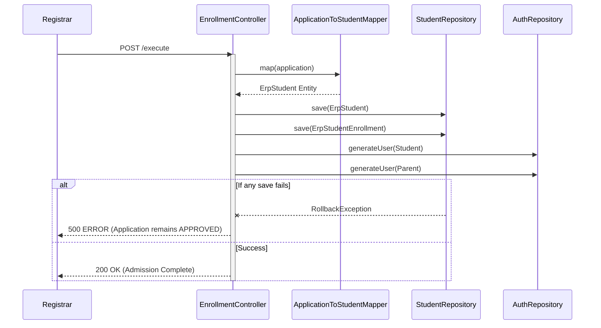

# 2. Technical Design Document (TDD)
## Project: Montfort Uganda Multi-School ERP
## Module: Admission Management System

---

## 1. Database Tables & Entities
The system leverages existing tables but requires one new table to support the detailed Teacher Assessment workflow.

| Database Table | JPA Entity | Repository | Purpose |
| :--- | :--- | :--- | :--- |
| `erp_applications` | `ErpApplication` | `ErpApplicationRepository` | Master Applicant Record |
| `erp_application_documents` | `ErpApplicationDocument` | `ErpApplicationDocumentRepo` | Uploaded PDFs/Images |
| `erp_application_status_history`| `ErpApplicationStatusHistory`| `ErpApplicationStatusHistoryRepo`| Workflow Audit Trail |
| `erp_application_interviews` | `ErpApplicationInterview` | `ErpApplicationInterviewRepo`| Scheduling / Parent Meeting |
| `erp_application_fees` | `ErpApplicationFee` | `ErpApplicationFeeRepo` | Registration & Admission Fees |
| `erp_scholarship_applications`| `ErpScholarshipApplication`| `ErpScholarshipApplicationRepo`| Financial Aid Requests |
| **`erp_application_marks`** (NEW)| **`ErpApplicationMark`** | **`ErpApplicationMarkRepo`** | Stores Teacher subject marks |

## 2. API Contract Specification (Controllers & Services)

### A. Admission Officer Service (`AdmissionOfficerController`)
- **`GET /api/admission/officer/applications`**
  - **Permissions:** `APPLICATION_VIEW`
  - **Purpose:** Fetch applications pending verification.
- **`POST /api/admission/officer/applications/{id}/verify`**
  - **Permissions:** `APPLICATION_VERIFY`
  - **Purpose:** Update status to `VERIFIED` or `MISSING_DOCS`.
- **`POST /api/admission/officer/applications/{id}/assign-teacher`**
  - **Permissions:** `APPLICATION_ASSIGN_TEACHER`
  - **Purpose:** Assign application to a specific teacher ID.
- **`POST /api/admission/officer/applications/{id}/parent-meeting`**
  - **Permissions:** `APPLICATION_PARENT_MEETING`
  - **Purpose:** Log parent acceptance/decline of school rules and fee structure.

### B. Teacher Assessment Service (`TeacherAdmissionController`)
- **`GET /api/admission/teacher/assigned`**
  - **Permissions:** `APPLICATION_TEACHER_VIEW`
  - **Purpose:** Fetch applications assigned to the logged-in teacher.
- **`POST /api/admission/teacher/applications/{id}/marks`**
  - **Permissions:** `APPLICATION_ENTER_MARKS`
  - **Request Body:** `{ "subject": "Math", "writtenScore": 85, "oralScore": 15, "remarks": "...", "recommendation": "RECOMMENDED" }`
  - **Purpose:** Saves to `erp_application_marks` and updates application status to `ASSESSED`.

### C. Scholarship Processing Service (`ScholarshipAdmissionController`)
- **`POST /api/admission/scholarships/{id}/forward`**
  - **Permissions:** `SCHOLARSHIP_FORWARD`
  - **Purpose:** Forwards request to Super Admin if branch funds are depleted.
- **`POST /api/admission/scholarships/{id}/allocate`**
  - **Permissions:** `SCHOLARSHIP_ALLOCATE`
  - **Purpose:** Approves scholarship and recalculates pending fee invoice.

### D. Fee Collection Service (`FeeAdmissionController`)
- **`POST /api/admission/fees/{id}/collect`**
  - **Permissions:** `FEE_COLLECT`
  - **Request Body:** `{ "amount": 500000, "paymentMode": "BANK_TRANSFER" }`
  - **Purpose:** Logs payment. Triggers `FEE_RECEIPT_EMAIL`.

### E. Enrollment Execution Service (`EnrollmentController`)
- **`POST /api/admission/enrollment/{id}/execute`**
  - **Permissions:** `ENROLLMENT_COMPLETE`
  - **Transaction:** `@Transactional(rollbackFor = Exception.class)`
  - **Purpose:** Maps `ErpApplication` -> `ErpStudent`. Generates Admission No, logins.

## 3. Transactions & Sequence Diagrams

### The Enrollment Transaction Protocol
Because generating a student touches 5 different modules, it must be highly transactional.

## 4. Email Flow Matrix
Managed by `EmailService.java`.

| Trigger Event | Template | Variables | Recipients | Retry Strategy |
| :--- | :--- | :--- | :--- | :--- |
| `DOCS_MISSING` | `docs_missing` | `missingList`, `uploadLink` | Parent | Max 3 retries |
| `TEACHER_ASSIGNED` | `teacher_assign` | `applicantName`, `date` | Teacher | 1 retry |
| `TEST_SCHEDULED` | `test_scheduled` | `date`, `time`, `venue` | Parent | Max 3 retries |
| `TEST_REMINDER` | `test_reminder` | `date`, `time` | Parent | Send T-24 hours |
| `PARENT_MEETING` | `parent_meeting` | `date`, `officerName` | Parent | Max 3 retries |
| `SCHOLARSHIP_SUB` | `scholar_submit` | `refNo` | Parent | 1 retry |
| `SCHOLARSHIP_APP` | `scholar_approve`| `amount`, `newFee` | Parent | Max 3 retries |
| `SCHOLARSHIP_REJ` | `scholar_reject` | `refNo` | Parent | Max 3 retries |
| `FEE_DUE_REMINDER`| `fee_reminder` | `dueDate`, `amount` | Parent | Send T-7 days |
| `PAYMENT_RECEIPT` | `fee_receipt` | `amount`, `pdfLink` | Parent | Max 3 retries |
| `ENROLLMENT_DONE` | `welcome_pack` | `studentId`, `parentLogin`| Parent & Student| Max 3 retries |

## 5. Expanded Permission Matrix

To support the highly granular dashboards, the following permissions must be injected into `erp_permissions`.

| Code | Purpose | Assigned Role |
| :--- | :--- | :--- |
| `APPLICATION_ASSIGN_TEACHER` | Assign to teacher | Admission Officer |
| `APPLICATION_TEACHER_VIEW` | View assigned apps | Teacher |
| `APPLICATION_ENTER_MARKS` | Log test results | Teacher |
| `APPLICATION_SHORTLIST` | Advance application | Admission Officer |
| `APPLICATION_PARENT_MEETING` | Log meeting outcomes | Admission Officer |
| `SCHOLARSHIP_FORWARD` | Escalate to Super Admin | Scholarship Officer |
| `SCHOLARSHIP_ALLOCATE` | Approve funds | Principal / Super Admin |
| `FEE_RECEIPT_EMAIL` | Resend/generate receipts| Fee Officer |
| `ENROLLMENT_COMPLETE` | Execute student creation | Registrar |
| `APPLICATION_GENERATE_STUDENT`| Alt Enrollment Trigger | Registrar |
