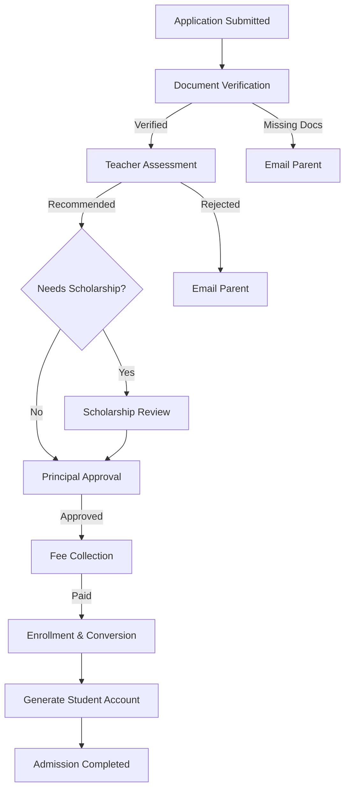

# Enterprise Business Requirement Document (BRD)
## Project: Montfort Uganda Multi-School ERP
## Module: Admission Management System
**Date:** 2026-07-14
**Status:** DRAFT (Read-Only Architecture Analysis)

---

## 1. Executive Summary
The Admission Management System is the gateway module for the Montfort Uganda Multi-School ERP. It facilitates the end-to-end lifecycle of a student's entry into the school system—from the initial public application submission by a parent, through document verification, teacher assessment, principal approval, fee collection, and finally, the automated creation of the student's ERP profile and login credentials. This BRD serves as the functional blueprint for implementing the internal administrative processing dashboards and business logic required to support this workflow.

## 2. Current Architecture Analysis
The public-facing components of the Admission module are partially implemented (`PublicApplicationController`). Parents can submit applications, which are persisted into the `erp_applications` table. However, the internal processing pipeline (Dashboards, Verification APIs, Email Triggers, and automated Student Conversion) is entirely missing. 

The underlying database schema is robust and ready:
- `erp_applications` (Master record)
- `erp_application_documents` (Uploads)
- `erp_application_interviews` (Scheduling)
- `erp_application_fees` (Registration payments)
- `erp_application_status_history` (Audit log)

## 3. Admission Business Process

### Stage 1: Application Submitted
- **Purpose:** Intake of new student requests.
- **Owner:** Parent / System
- **Entry Criteria:** Parent completes `/api/public/applications/submit`.
- **Exit Criteria:** Application lands in `PENDING` queue.
- **Outcomes:** Proceed to Verification.
- **Notifications:** "Application Received" email to Parent.

### Stage 2: Document Verification
- **Purpose:** Ensure all uploaded documents (Birth Cert, Previous Results) are valid.
- **Owner:** Admission Officer
- **Entry Criteria:** Application in `PENDING`.
- **Exit Criteria:** Status changes to `VERIFIED` or `REJECTED_MISSING_DOCS`.
- **Outcomes:** Proceed to Assessment OR Return to Parent.

### Stage 3: Teacher Assessment / Interview
- **Purpose:** Academic evaluation of the applicant.
- **Owner:** Teacher / Interviewer
- **Entry Criteria:** Application is `VERIFIED`.
- **Exit Criteria:** Interview logged in `erp_application_interviews`. Status: `ASSESSED`.
- **Outcomes:** Recommend for Admission, Waitlist, or Reject.

### Stage 4: Scholarship Review (Optional)
- **Purpose:** Evaluate financial aid requests.
- **Owner:** Scholarship Officer
- **Entry Criteria:** Parent requested aid during submission.
- **Exit Criteria:** Aid Approved/Rejected via `erp_scholarship_applications`.
- **Outcomes:** Adjust fee ledger template.

### Stage 5: Principal Approval
- **Purpose:** Final authoritative sign-off.
- **Owner:** Principal
- **Entry Criteria:** Application is `ASSESSED`.
- **Exit Criteria:** Status changes to `APPROVED`.
- **Outcomes:** Parent notified, proceeds to Fee Collection.

### Stage 6: Fee Collection
- **Purpose:** Collect admission/term fees.
- **Owner:** Fee Officer
- **Entry Criteria:** Application is `APPROVED`.
- **Exit Criteria:** Payment logged in `erp_application_fees`.
- **Outcomes:** Proceed to Enrollment.

### Stage 7: Enrollment & Student Creation
- **Purpose:** Migrate Application data to core ERP tables.
- **Owner:** System (Automated)
- **Entry Criteria:** Fees paid.
- **Exit Criteria:** Record created in `erp_students`, `erp_student_enrollment`.
- **Outcomes:** Admission Completed, Student Account generated.

## 4. Workflow Diagram

## 5. User Roles

| Role | Responsibilities | Accessible Dashboards |
| :--- | :--- | :--- |
| **Parent** | Submit application, upload docs, pay fees. | Public Portal, Parent Portal |
| **Admission Officer**| Verify documents, communicate with parents. | Pending Admissions, Verification Dashboard |
| **Teacher** | Conduct interviews, log academic assessments. | Interview Schedule, Assessment Dashboard |
| **Scholarship Officer**| Review financial aid requests. | Scholarship Processing Dashboard |
| **Principal** | Final approval of all admissions. | Principal Approval Queue |
| **Fee Officer** | Verify offline payments, manage fee receipts. | Admission Fee Dashboard |
| **Registrar** | Oversee entire pipeline, resolve disputes. | Full Admission Overview |

## 6. Dashboard Specifications
### A. The Admissions Hub (Main Dashboard)
- **Target User:** Admission Officer, Registrar
- **KPIs:** Total Applications, Pending Verification, Interviews Scheduled, Approved today.
- **Quick Actions:** Bulk Verify, Export to Excel.
- **Filters:** Academic Year, Class, Status, Date Range.
- **Table Columns:** App Ref, Student Name, Class, Status, Submitted Date, Actions.

### B. Interview & Assessment Dashboard
- **Target User:** Teachers, Principal
- **KPIs:** Interviews Today, Pending Assessments, Passed/Failed Ratio.
- **Quick Actions:** Log Result, Reschedule.
- **Timeline:** Calendar view of `erp_application_interviews`.

## 7. Screen Specifications
1. **List Screen (`admissions-list.html`):** Datatable with server-side pagination. Row actions: View, Quick Approve, Reject.
2. **Detail Screen (`admission-detail.html`):** 
   - *Header:* Applicant Profile (Photo, Name, Class).
   - *Tabs:* Details, Documents, Interview Logs, Fee Status, Timeline.
3. **Document Viewer Component:** Inline PDF/Image viewer for quick document verification without downloading.
4. **Timeline Screen:** Renders `erp_application_status_history` sequentially (e.g., "Submitted 10:00 AM -> Verified 11:30 AM").

## 8. Business Rules
- **Document Rules:** Mandatory documents (e.g., Birth Certificate) must exist before `APPLICATION_VERIFY` can execute.
- **Duplicate Rules:** System must check `erp_students` for matching Name + DOB + Parent Phone to prevent re-admission duplicates.
- **Rollback Rules:** If the `Student Conversion` transaction fails at the `erp_student_enrollment` stage, the entire transaction rolls back, and the application remains `APPROVED`.
- **Fee Rules:** Enrollment cannot execute unless `erp_application_fees` shows a `PAID` status.

## 9. Permission Matrix

| Action / Capability | Permission Code |
| :--- | :--- |
| View Application List | `APPLICATION_VIEW` |
| Verify Documents | `APPLICATION_VERIFY` |
| Schedule Interviews | `APPLICATION_INTERVIEW` |
| Record Assessment | `APPLICATION_ASSESS` (Missing in DB) |
| Final Approval | `APPLICATION_APPROVE` |
| Reject Application | `APPLICATION_REJECT` |
| Process Admission Fee | `APPLICATION_FEE_COLLECT` (Missing) |
| Trigger Enrollment | `ENROLLMENT_CREATE` |

## 10. Email Notification Matrix

| Event | Trigger | Template Name | Variables |
| :--- | :--- | :--- | :--- |
| App Submitted | Creation | `admission_received` | `parentName`, `refNo` |
| Docs Missing | Status = `DOCS_PENDING` | `admission_missing_docs` | `refNo`, `missingDocsList` |
| Interview Set | Interview created | `admission_interview` | `date`, `time`, `interviewer` |
| Approved | Status = `APPROVED` | `admission_approved` | `studentName`, `feeLink` |
| Enrolled | Status = `ENROLLED` | `student_welcome` | `username`, `tempPassword` |

## 11. API Specification (Internal Dashboard APIs)

| API Endpoint | Method | Purpose | Permissions |
| :--- | :--- | :--- | :--- |
| `/api/admission/applications` | `GET` | Fetch paginated list | `APPLICATION_VIEW` |
| `/api/admission/applications/{id}` | `GET` | Fetch full details | `APPLICATION_VIEW` |
| `/api/admission/applications/{id}/verify` | `POST` | Update status to VERIFIED | `APPLICATION_VERIFY` |
| `/api/admission/applications/{id}/interview`| `POST` | Schedule interview | `APPLICATION_INTERVIEW`|
| `/api/admission/applications/{id}/approve` | `POST` | Final Principal approval | `APPLICATION_APPROVE`|
| `/api/admission/applications/{id}/enroll` | `POST` | Trigger student creation | `ENROLLMENT_CREATE` |

## 12. Database Mapping
- **Workflow State:** `erp_applications.status` (Enum: PENDING, VERIFIED, INTERVIEW_SCHEDULED, ASSESSED, APPROVED, REJECTED, ENROLLED).
- **Audit Logging:** Every status change writes a new row to `erp_application_status_history` via an `@EntityListener` or Service layer hook.
- **Target Mapping:** 
  - `ErpApplication` -> `ErpStudent`
  - `ErpApplication.guardianDetails` -> `ErpParent`
  - `ErpApplication.classId` -> `ErpStudentEnrollment.classId`

## 13. Gap Analysis
- **Architecture Gaps:** No `AdmissionToStudentMapper` exists to map the data during enrollment.
- **Workflow Gaps:** No cron jobs to auto-expire applications that have been pending fees for > 30 days.
- **Dashboard Gaps:** 100% of the internal branch admin UI is missing. 
- **Reporting Gaps:** No reporting APIs exist to calculate conversion rates (Submitted vs Enrolled).

## 14. Implementation Roadmap

| Phase | Module / Task | Priority | Dependencies | Complexity | Estimated Effort |
| :--- | :--- | :--- | :--- | :--- | :--- |
| **1** | **Internal APIs & Status Engine** Build core processing APIs in `BranchAdmissionController`. | Critical | None | Medium | 1 Week |
| **2** | **Admissions UI Dashboards** Build `branchadmin-admissions.html` and JS components. | Critical | Phase 1 | High | 2 Weeks |
| **3** | **Student Conversion Service** Build `@Transactional` service mapping App -> Student. | High | Phase 1 | High | 1 Week |
| **4** | **Email Integration** Hook admission events into existing `EmailService`. | Medium | Phase 1 | Low | 2 Days |
| **5** | **Interview Scheduling UI** Calendar integration for teachers and principals. | Low | Phase 2 | Medium | 1 Week |

## 15. Risks
- **Concurrency Risk:** Multiple officers approving the same application simultaneously. **Mitigation:** Rely on the existing `@Version` optimistic locking column in `erp_applications`.
- **Data Integrity Risk:** Missing mandatory fields during Student Creation. **Mitigation:** The `ErpApplication` must enforce strict validation equal to `ErpStudent` requirements.

## 16. Future Enhancements
- **Biometric Integration:** Capture fingerprints during the physical interview stage.
- **WhatsApp API:** Send real-time WhatsApp notifications instead of just email/SMS.
- **AI Assessment Parsing:** Use AI to scan uploaded previous report cards and automatically recommend acceptance/rejection.
