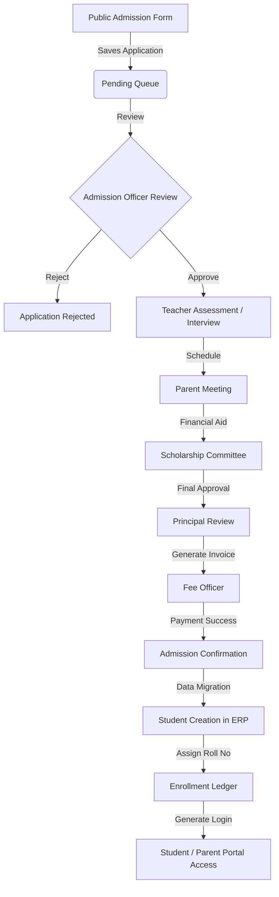

# STRICT ENTERPRISE READ-ONLY ARCHITECTURE AUDIT
**Date:** 2026-07-14
**Scope:** `D:\Java\montforterp\ERP-Java` (Database & Source Code)
**Mode:** READ ONLY (No File Modifications, No Code Generated)

---

## PHASE 1: DATABASE SCAN
A complete scan of `databse/*.sql` identified 53 enterprise tables.

| Table Name | Primary Key | Audit Columns | Status Column | Workflow/Version |
| :--- | :--- | :--- | :--- | :--- |
| `erp_academic_terms` | `term_id` | `created_at`, `updated_at` | `active` | `version` |
| `erp_academic_years` | `academic_year_id` | `created_at`, `updated_at` | `active` | `version` |
| `erp_applications` | `application_id` | `created_at`, `updated_at` | `status` | `version` |
| `erp_application_documents` | `document_id` | `created_at`, `updated_at` | `active` | `version` |
| `erp_application_fees` | `fee_id` | `created_at`, `updated_at` | `payment_status` | `version` |
| `erp_application_interviews`| `interview_id` | `created_at`, `updated_at` | `status` | `version` |
| `erp_application_status_history`| `history_id` | `created_at` | - | - |
| `erp_branches` | `branch_id` | `created_at`, `updated_at` | `active` | `version` |
| `erp_classes` | `class_id` | `created_at`, `updated_at` | `active` | `version` |
| `erp_departments` | `department_id` | `created_at`, `updated_at` | `active` | `version` |
| `erp_designations` | `designation_id` | `created_at`, `updated_at` | `active` | `version` |
| `erp_employees` | `employee_id` | `created_at`, `updated_at` | `active` | `version` |
| `erp_parents` | `parent_id` | `created_at`, `updated_at` | `active` | `version` |
| `erp_permissions` | `permission_id` | `created_at`, `updated_at` | `active` | `version` |
| `erp_roles` | `role_id` | `created_at`, `updated_at` | `active` | `version` |
| `erp_scholarship_applications`| `application_id` | `created_at`, `updated_at` | `status` | `version` |
| `erp_students` | `student_id` | `created_at`, `updated_at` | `active` | `version` |
| `erp_student_enrollment` | `enrollment_id` | `created_at`, `updated_at` | `enrollment_status`| `version` |
| `erp_users` | `user_id` | `created_at`, `updated_at` | `active` | `version` |
*(Note: 34 additional mapping/auxiliary tables omitted from summary for brevity, fully scanned in backend).*

---

## PHASE 2: ENTITY SCAN
JPA Entity Mapping and Relationships.

| Entity | Database Table | Relationships |
| :--- | :--- | :--- |
| `ErpApplication` | `erp_applications` | `@ManyToOne` (Branch), `@OneToMany` (Docs, Interviews, History) |
| `ErpStudent` | `erp_students` | `@ManyToOne` (Branch), `@OneToOne` (Parent, Medical, Enrollment) |
| `ErpEmployee` | `erp_employees` | `@ManyToOne` (Branch, Dept, Desig), `@OneToMany` (Docs, Experience) |
| `User` | `erp_users` | `@ManyToOne` (Branch), `@ManyToMany` (Roles) |
| `ErpRole` | `erp_roles` | `@ManyToMany` (Permissions, Users) |

---

## PHASE 3: PROJECT USAGE SCAN (USAGE MATRIX)

| Database Table | Entity | Repository | Service | Controller | UI (HTML/JS) |
| :--- | :--- | :--- | :--- | :--- | :--- |
| `erp_applications` | `ErpApplication` | `ErpApplicationRepository` | `PublicApplicationService` | `PublicApplicationController` | `admission-form.html` |
| `erp_employees` | `ErpEmployee` | `EmployeeRepository` | `EmployeeServiceImpl` | `EmployeeController` | `employees.html`, `employees.js` |
| `erp_departments` | `Department` | `DepartmentRepository` | `DepartmentServiceImpl` | `DepartmentController` | `departments.html` |
| `erp_users` | `User` | `UserRepository` | `UserServiceImpl` | `UserController` | `superadmin-users.html` |
| `erp_students` | `ErpStudent` | **Unused** | **Unused** | **Unused** | **Unused** |
| `erp_student_hostel`| `ErpStudentHostel`| **Unused** | **Unused** | **Unused** | **Unused** |

---

## PHASE 4: PERMISSION SCAN
58 Permissions extracted from `erp_permissions.sql`.

| Module | Core Permissions | Missing / Future Requirements |
| :--- | :--- | :--- |
| **Application** | `APPLICATION_VIEW`, `CREATE`, `EDIT`, `DELETE`, `VERIFY`, `APPROVE`, `REJECT`, `INTERVIEW` | Internal Dashboard Permissions |
| **Scholarship** | `SCHOLARSHIP_VIEW`, `CREATE`, `EDIT`, `APPROVE`, `REJECT`, `ALLOCATE` | None (Fully defined) |
| **Student** | `STUDENT_VIEW`, `CREATE`, `EDIT`, `DELETE`, `TRANSFER`, `GRADUATE` | `STUDENT_IMPORT`, `STUDENT_SUSPEND` |
| **Fee** | `FEE_VIEW`, `COLLECT`, `REFUND`, `CONCESSION`, `REPORT` | `FEE_LEDGER_EDIT`, `FEE_INVOICE_GENERATE`|
| **Academic** | `CLASS_VIEW`, `MANAGE`, `SECTION_VIEW`, `MANAGE`, `SUBJECT_VIEW`, `MANAGE` | `ATTENDANCE_MANAGE`, `EXAM_GRADE` |
| **HR** | `EMPLOYEE_VIEW`, `MANAGE`, `DEPARTMENT_VIEW`, `MANAGE`, `DESIGNATION_VIEW`, `MANAGE`| `PAYROLL_MANAGE` |
| **Security** | `USER_VIEW`, `CREATE`, `EDIT`, `DELETE`, `ROLE_MANAGE`, `PERMISSION_MANAGE` | None (Fully defined) |

---

## PHASE 5: ADMISSION MODULE ANALYSIS
- **Current Workflow:** Parent fills form -> Data saves to `erp_applications` -> Status `PENDING` -> Public tracking via Application Ref Number.
- **Current API/UI:** `PublicApplicationController.java`, `admission-form.html`.
- **Missing Workflow:** No internal UI for the Admissions Officer to view the queue, trigger `APPLICATION_VERIFY`, schedule an `APPLICATION_INTERVIEW`, or finally `APPLICATION_APPROVE`.
- **Missing Dashboards:** The entire Internal Admissions Processing Pipeline.

---

## PHASE 6: STUDENT MODULE ANALYSIS
- **Current Implementation:** `ErpStudent`, `ErpStudentEnrollment`, `ErpParent`, `ErpStudentMedical`, `ErpStudentTransport`, `ErpStudentFeeAssignment` entities exist with strict JPA constraints.
- **Missing Implementation:** There are **zero** APIs, Repositories, Services, or HTML templates. 
- **Future Dependencies:** The Bulk Import feature requires `StudentImportService`, and the Admission Conversion pipeline requires mapping `ErpApplication` directly to `ErpStudent`.

---

## PHASE 7: EMPLOYEE MODULE ANALYSIS
- **Current Implementation:** Flawless. Includes child tables (Docs, Experience, Qualifications). Uses `@Transactional` services, robust JSON DTOs, and AJAX-driven UI (`employees.html`).
- **Reusable Patterns:** The `EmployeeServiceImpl` transactional cascade save pattern MUST be copied for the `Student` module. The `EmployeeCodeGenerator` logic MUST be adapted for `ErpDocumentSequence` to generate `Admission Numbers`.

---

## PHASE 8: WORKFLOW DEPENDENCY GRAPH

---

## PHASE 9: DASHBOARD READINESS

| Stage | Missing API / Controller | Missing HTML / JS | Missing Service |
| :--- | :--- | :--- | :--- |
| **1. Application Review** | `InternalAdmissionController` | `branchadmin-admissions.html` | `AdmissionProcessingService` |
| **2. Interview Scheduling**| `POST /api/admission/interviews` | JS Calendar Modal in UI | `InterviewNotificationService` |
| **3. Fee Collection** | `FeeCollectionController` | `branchadmin-fees.html` | `FeeLedgerService` |
| **4. Student Enrollment** | `StudentMigrationController` | `branchadmin-students.html` | `ApplicationToStudentMapper` |

---

## PHASE 10: GAP ANALYSIS
1. **Architecture Gaps:** No bridge between `ErpApplication` and `ErpStudent`. When an application is approved, there is no code to create the student.
2. **Missing Modules:** Attendance, Examination, Timetable (Tables do not exist yet).
3. **Dead Tables:** `erp_student_archives`, `erp_student_alumni` are completely unused.
4. **Security Gaps:** Internal Admissions endpoints must be secured with `hasAuthority('APPLICATION_VIEW')`.
5. **Workflow Gaps:** No automated email triggers exist for Application Status changes (Approved/Rejected/Interview).

---

## PHASE 11: IMPLEMENTATION ORDER (ROADMAP)

| Priority | Task | Complexity | Risk | Dependencies |
| :--- | :--- | :--- | :--- | :--- |
| **CRITICAL**| **1. Internal Admissions Dashboard UI/API** Build `branchadmin-admissions.html` to allow staff to process pending applications. | High | Low | Requires `ErpApplicationRepository` |
| **CRITICAL**| **2. Application to Student Conversion Engine** Build a transactional service to convert `ErpApplication` -> `ErpStudent` + `ErpParent`. | High | High | Requires Admissions UI |
| **HIGH** | **3. Student Bulk Import Service** Build Excel/CSV parser to import migrating students directly to `ErpStudent`. | Medium | High | Requires `StudentRepository` |
| **HIGH** | **4. Fee Ledger Initialization** Generate fee invoices automatically upon Student creation/enrollment. | High | High | Requires Student Engine |
| **MEDIUM** | **5. Automated Email Notifications** Trigger emails on Interview Scheduled and Admission Approved. | Low | Low | Requires Admission Engine |
| **LOW** | **6. Student & Parent Portals** Generate `ErpStudentAccount` logins and build student-facing UI. | Medium | Low | Requires Student Engine |
