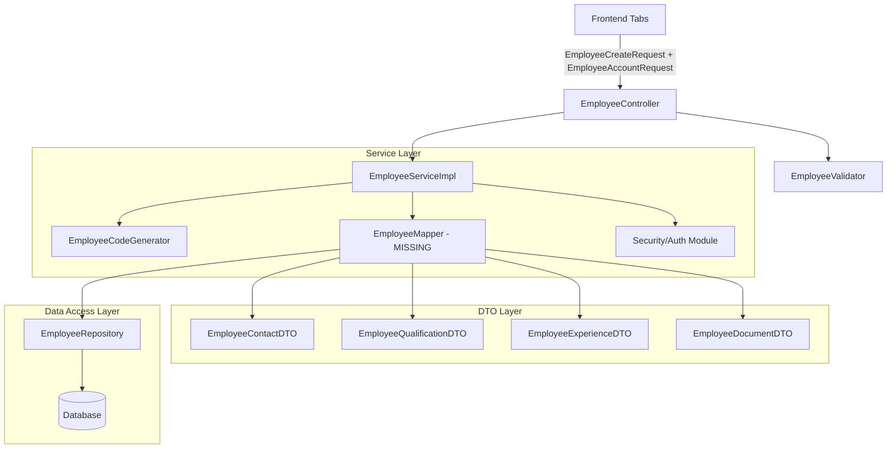

# ENTERPRISE MAINTENANCE SCAN REPORT

## 1. Existing Classes (Employee Module)

### Entities (`entity`)
- `ErpEmployee`
- `ErpEmployeeContact`
- `ErpEmployeeDocument`
- `ErpEmployeeExperience`
- `ErpEmployeeQualification`

### DTOs (`dto`)
- `EmployeeCreateRequest`
- `EmployeeUpdateRequest`
- `EmployeeResponse`
- `EmployeeListResponse`
- `EmployeeSearchCriteria`
- `EmployeeAccountRequest`
- `EmployeeContactDTO`
- `EmployeeContactRequest`
- `EmployeeDocumentDTO`
- `EmployeeDocumentRequest`
- `EmployeeExperienceDTO`
- `EmployeeExperienceRequest`
- `EmployeeQualificationDTO`
- `EmployeeQualificationRequest`

### Controllers (`controller`)
- `EmployeeController`

### Services (`service`)
- `EmployeeService`
- `EmployeeImportService`
- `EmployeeServiceImpl` (in `service.impl`)

### Repositories (`repository`)
- `EmployeeRepository`
- `EmployeeContactRepository`
- `EmployeeDocumentRepository`
- `EmployeeExperienceRepository`
- `EmployeeQualificationRepository`

### Specifications (`specification`)
- `EmployeeSpecificationBuilder`

### Validators (`validation`)
- `EmployeeValidator`

### Enums (`enums`)
- `ContactRelationship`, `ContactType`, `EmployeeCategory`, `EmployeeDocumentStatus`, `EmployeeDocumentType`, `EmployeeType`, `EmploymentMode`, `EmploymentStatus`, `ExperienceEmploymentType`, `Gender`, `LoginMethod`, `QualificationLevel`, `QualificationStatus`

### Generators (`generator`)
- `EmployeeCodeGenerator`, `EmployeeCodeGeneratorImpl`

---

## 2. Missing Classes
- `EmployeeMapper` (No mapper currently exists to translate DTOs to Entities).

---

## 3. Duplicate Classes (Conflicts Detected)
The recent additions violated **Rule 2 (NEVER create duplicate DTOs)**. The following classes represent the exact same domain objects:
- `EmployeeContactRequest` duplicates `EmployeeContactDTO`
- `EmployeeDocumentRequest` duplicates `EmployeeDocumentDTO`
- `EmployeeExperienceRequest` duplicates `EmployeeExperienceDTO`
- `EmployeeQualificationRequest` duplicates `EmployeeQualificationDTO`

---

## 4. Merge Recommendations
To comply with the strict maintenance rules, the following merges are recommended:

1. **EXISTING FILE:** `EmployeeContactDTO`
   - **MODIFICATION REQUIRED:** Move all `@NotNull`, `@Size`, and `@Pattern` validations from `EmployeeContactRequest` into this file.
   - **Reason:** Prevent parallel object structures.

2. **EXISTING FILE:** `EmployeeDocumentDTO`
   - **MODIFICATION REQUIRED:** Move metadata tracking and lifecycle enums from `EmployeeDocumentRequest` into this file.
   - **Reason:** Consolidate document payloads.

3. **EXISTING FILE:** `EmployeeExperienceDTO`
   - **MODIFICATION REQUIRED:** Move experience timeline and salary logic from `EmployeeExperienceRequest` into this file.
   - **Reason:** Consolidate experience payloads.

4. **EXISTING FILE:** `EmployeeQualificationDTO`
   - **MODIFICATION REQUIRED:** Move decimal validations and lifecycle enums from `EmployeeQualificationRequest` into this file.
   - **Reason:** Consolidate qualification payloads.

5. **EXISTING FILE:** `EmployeeCreateRequest`
   - **MODIFICATION REQUIRED:** Update internal collections to reference `List<EmployeeContactDTO>`, `List<EmployeeDocumentDTO>`, etc.
   - **Reason:** Point to the newly consolidated DTOs.

**(Action Required: The redundant `*Request` child classes will be ignored moving forward).**

---

## 5. Files To Modify
- `EmployeeContactDTO`
- `EmployeeQualificationDTO`
- `EmployeeExperienceDTO`
- `EmployeeDocumentDTO`
- `EmployeeCreateRequest` (Update references)
- `EmployeeUpdateRequest` (Update references)
- `EmployeeResponse` (Update references)
- `EmployeeService` (Add user account provisioning methods)
- `EmployeeServiceImpl` (Implement the business flow)

---

## 6. Files To Leave Untouched
- `ErpEmployee` and all child entities (already complete).
- All Enums (already complete).
- `EmployeeRepository` and child repositories (already complete).
- `EmployeeCodeGenerator` (already complete).

---

## 7. Final Architecture Diagram

