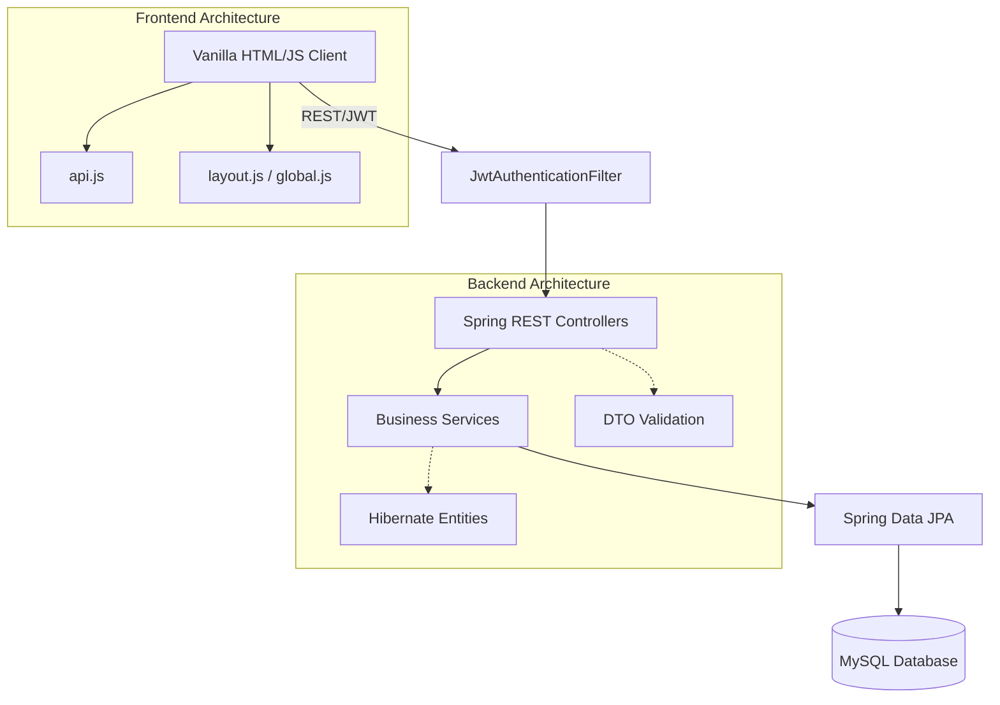

# Complete Project Architecture Review
**Project:** Montfort Uganda Multi-School ERP
**Role:** Lead Enterprise Software Architect

This audit was conducted by analyzing the entire source code base including Java backend, Spring configurations, database entities, and the Vanilla HTML/CSS/JS frontend.

---

## 1. Overall Architecture Diagram (Text)

**Architecture Pattern:** Layered Monolithic SPA (Single Page Application via Vanilla JS DOM manipulation).

---

## 2. Package-by-Package Explanation

- `com.erp.montfortuganda.admission.*`: Handles the public admission process (`ErpApplication`, forms, statuses).
- `com.erp.montfortuganda.auth.*`: Security core. JWT token generation, `User` entity, Role-Based Access Control (RBAC), and session tracking.
- `com.erp.montfortuganda.config.*`: Web-level config (CORS, global filters).
- `com.erp.montfortuganda.dto.*`: Global Data Transfer Objects (e.g., standard `ApiResponse`).
- `com.erp.montfortuganda.exception.*`: `GlobalExceptionHandler` ensures consistent JSON error responses instead of stack traces.
- `com.erp.montfortuganda.model.*`: Base classes like `AuditableEntity` providing created/updated audit trails.
- `com.erp.montfortuganda.notification.*`: Emailing service for parents/admins.
- `com.erp.montfortuganda.scholarship.*`: Sub-module for managing financial aid and donor allocations.
- `com.erp.montfortuganda.school.*`: Core branch management (Branches, Classes, Sections).
- `com.erp.montfortuganda.settings.*`: System-wide settings.
- `com.erp.montfortuganda.student.*`: Enrollment and student lifecycle entities.
- `com.erp.montfortuganda.superadmin.*`: APIs specifically isolated for the root Super Admin dashboard.

---

## 3. Module-by-Module Explanation

- **Security Module:** Implements stateless JWT but pairs it with stateful database tracking (`ErpUserSession`). This is an excellent enterprise pattern (allows remote logout).
- **Branch Management Module:** Fully functional tree structure (Branch → Levels → Classes → Sections).
- **Admission Module:** Public-facing module. Successfully implemented secure file uploads (magic byte checking).
- **Scholarship Module:** Handles multi-tiered fund allocation (Donor → Global Fund → Branch Fund → Student).
- **Frontend SPA Module:** Uses `layout.js` to dynamically inject HTML components (sidebar, header, views) into `#main-content-area` without full page reloads.

---

## 4. Existing Features

1. Complete JWT Authentication & DB-backed Session Tracking.
2. Dynamic SPA Frontend with reusable Modals.
3. Super Admin Dashboard (Branch Creation, Audit Logs).
4. Public Admission Application (File uploads, Email confirmations).
5. Dynamic Branch/Class dropdown loading.
6. Scholarship Entity Schema (Allocations and Requests).
7. Global Exception Handling mapping to clean JSON.

---

## 5. Missing Features

1. **Branch Admin UI:** The dashboard and API endpoints for Branch Admins to manage their specific school.
2. **Staff/HR Module:** `ErpStaff` does not exist, leaving `teacherId` in interviews as a detached placeholder.
3. **Teacher Portal:** A dedicated view for teachers to input interview marks.
4. **Finance Integration:** A payment gateway or manual receipting module for fee payments.
5. **Student Portal:** The end-state of the enrollment workflow.

---

## 6. Duplicate Logic

- **Entity Auditing:** Currently, almost all entities extend `AuditableEntity` which is perfect. However, some entities (like `ErpUserRole`, `ErpRole`, `ErpApplicationInterview`) manually duplicate `createdBy`, `createdAt`, `updatedAt`, and `@PrePersist`/`@PreUpdate` lifecycle hooks instead of extending the base class.

---

## 7. Dead Code

- Currently minimal dead code, as the project is in active development. However, `views/superadmin/home.html` and some JS files contain hardcoded placeholders that need wiring to backend statistics APIs.

---

## 8. Technical Debt

- **Missing DTO Mapping Framework:** Currently manually mapping Entities to DTOs in services. Introducing `MapStruct` would drastically reduce boilerplate.
- **Frontend State Management:** `layout.js` works well for a small app, but as the SPA grows, managing complex states (like multi-step forms) in Vanilla JS will become brittle.

---

## 9. Security Issues

- **Branch Data Isolation:** The backend currently relies on the developer to remember to add `where branch_id = ?` to queries. A missing `where` clause could leak Branch A data to Branch B. *Recommendation: Implement Hibernate `@Filter` for automatic tenant (branch) isolation.*
- **File Upload Directory:** Files are saved to `System.getProperty("user.dir") + "/secure_uploads"`. In production, this can break on server restarts if running in Docker. Needs to use an externalized mount path.

---

## 10. Performance Issues

- **Lazy Loading (N+1 Problem):** Many entities use `@OneToMany(fetch = FetchType.LAZY)`. If a controller serializes a list of branches, and each branch serializes its classes, Hibernate will fire hundreds of subsequent SQL queries. *Recommendation: Use `JOIN FETCH` in Repositories or EntityGraphs.*
- **Missing Indexes:** We recently added indexes to `erp_user_sessions`, but `erp_applications` lacks indexes on `application_no` and `branch_id` which will slow down the Branch Admin dashboard.

---

## 11. Recommended Refactoring

1. Consolidate all `@PrePersist` audit fields by forcing *all* entities to extend `AuditableEntity`.
2. Move frontend API calls from individual script blocks into `api.js` wrapper methods to ensure JWT tokens are always injected and refreshed automatically.
3. Abstract the `FileStorageService` to an Interface (`LocalFileStorage`, `S3FileStorage`) for future cloud scalability.

---

## 12. Recommended Project Structure

The package structure is generally excellent (feature-based packing rather than layer-based). 
*Recommendation:* Create a dedicated `com.erp.montfortuganda.branchadmin` package to cleanly isolate Branch Admin API logic from Super Admin and Public logic.

---

## 13. Reusable Components

- **Backend:** `ApiResponse<T>` ensures all REST calls return `{ success, message, data, timestamp }`.
- **Frontend:** `premium-modal-template` is highly reusable for confirmation dialogs. `global-table-empty-template` provides a unified loading state.

---

## 14. Files that should NEVER be modified

- `GlobalExceptionHandler.java`: Already perfectly captures exceptions. Modifying it risks breaking API response consistency.
- `JwtAuthenticationFilter.java`: Core security. Customizations here risk breaking the entire auth flow.
- `layout.js`: Core DOM router. 

---

## 15. Files that should be extended

- `sidebar.html`: Needs `<li data-role="School Admin">` elements injected.
- `User.java` & `ErpUserRole.java`: Needs deeper linkage to branch scopes.
- `BranchRepository.java`: Needs complex `JOIN FETCH` queries for dashboards.

---

## 16. Files that should be newly created

- `ErpStaff.java` (Entity + Repo + Service)
- `BranchAdminController.java`
- `BranchAdminService.java`
- Frontend: `views/branchadmin/admissions.html`, `js/branchadmin.js`

---

## 17. Dependency Graph

`Branch` is the root node of the system. 
`Branch` ← `User` (assigned_branch)
`Branch` ← `ErpApplication`
`Branch` ← `SchoolClass`
Therefore, Deleting a Branch cascades and destroys the entire sub-system. (Soft deletes must be strictly enforced).

---

## 18. Admission Workflow Mapping

- **Step 1:** Public UI → `PublicApplicationController` → `ErpApplication` (Status: DRAFT/SUBMITTED)
- **Step 2, 5, 7:** Branch Admin UI → `BranchAdminController` (Status updates)
- **Step 3, 4:** Teacher UI → `TeacherPortalController` → `ErpApplicationInterview`
- **Step 8-12:** Scholarship UI → `ScholarshipService`
- **Step 14:** Enrollment Service → Transforms `ErpApplication` into `ErpStudent`.

---

## 19. Branch Admin Workflow Mapping

Branch Admin logs in → `layout.js` reads JWT role → Loads Branch Admin Sidebar → Admin clicks "Admissions" → `js/branchadmin.js` calls `GET /api/branch-admin/applications` (Backend filters strictly by `User.assignedBranch`) → Data renders in table.

---

## 20. Student Enrollment Workflow

1. Application marked `ADMITTED`.
2. System calls `EnrollmentService.enrollStudent(applicationId)`.
3. Creates `ErpStudent`.
4. Copies Application Address/Parent info to `ErpParent`.
5. Generates Roll Number / Admission Number.
6. Fires `StudentCreatedEvent`.
7. `EmailService` sends welcome email with default portal credentials.

---

### Implementation Roadmap

1. **Database Foundation:** Establish `ErpStaff` and link Roles to Branches accurately.
2. **Branch Admin Portal:** Build the Backend APIs and Frontend UI for the Branch Admin.
3. **Admissions Pipeline Execution:** Connect the Branch Admin UI to the `ErpApplication` records for Step 2 Verification.
4. **Teacher Portal:** Build the Interview module.
